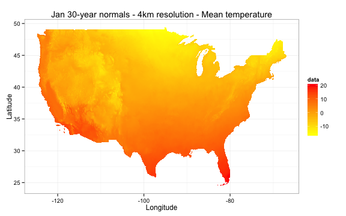
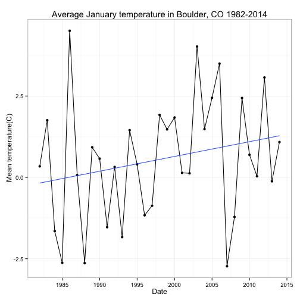
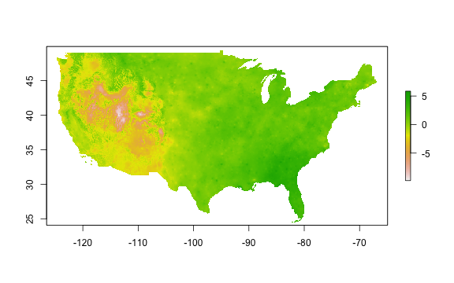

##`prism`

[](https://travis-ci.org/ropensci/prism)
[](https://ci.appveyor.com/project/sckott/prism/branch/master)

A package to access and visualize data from the [Oregon State PRISM project](http://www.prism.oregonstate.edu/).  Data is all in the form of gridded rasters for the continental US at 3 different scales: daily, monthly and 30 year normals.  Please see their webpage for a full description of the data products, or [see their overview](http://www.prism.oregonstate.edu/documents/PRISM_datasets_aug2013.pdf).

### Quickstart
Currently the package is only available on github and installable with `devtools`

```r
library(devtools)
install_github(repo = "prism", username = "ropensci")
library(prism)
```

### Downloading data

Data is available in 3 different forms as mentioned above.  Each one has it's own function to download data. While each data type has slightly different temporal parameters, the type options are always the same.  Keep in mind these are modeled parameters, not measured.  Please see the [full description](http://www.prism.oregonstate.edu/documents/Daly2008_PhysiographicMapping_IntJnlClim.pdf) for how they are calculated.

| Parameter name| Descrption           |
|:---------------:|:-------------:|
| *tmean*      | Mean temperature |
| *tmax*      | Maximum temperature      |
| *tmin* | Minimum temperature      |
| *ppt*  | Total precipitation (Rain and snow)|

**Normals**

Normals are based on the years 1981 - 2010, and can be downloaded in two resolutions, `4km` and `800m`, and a resolution must be specified.  Normals can also be downloaded for a given month, vector of months, or an average for all 30 years.


```r
library(prism)
options(prism.path = "~/prismtmp")
get_prism_normals(type="tmean",resolution = "4km",mon = 1:6, keepZip=F)
```

```
## 
  |                                                                       
  |                                                                 |   0%
  |                                                                       
  |===========                                                      |  17%
  |                                                                       
  |======================                                           |  33%
  |                                                                       
  |================================                                 |  50%
  |                                                                       
  |===========================================                      |  67%
  |                                                                       
  |======================================================           |  83%
  |                                                                       
  |=================================================================| 100%
```

The first thing to note is that you'll need to set a local location to work with this data.  Second is the option `keepZip`.  If this is `TRUE` the zip file will remain on your machine, otherwise it will be automatically deleted.

You can also view all the data you have downloaded with a simple command `ls_prism_data()`.  By default this just gives a list of file names.  All the internal functions in the package work off of this simple list of files.

```r
ls_prism_data()
```

```
##                                    files
## 1   PRISM_tmean_30yr_normal_4kmM2_01_bil
## 2   PRISM_tmean_30yr_normal_4kmM2_02_bil
## 3   PRISM_tmean_30yr_normal_4kmM2_03_bil
## 4   PRISM_tmean_30yr_normal_4kmM2_04_bil
## 5   PRISM_tmean_30yr_normal_4kmM2_05_bil
## 6   PRISM_tmean_30yr_normal_4kmM2_06_bil
## 7  PRISM_tmean_stable_4kmD1_20130601_bil
## 8  PRISM_tmean_stable_4kmD1_20130602_bil
## 9  PRISM_tmean_stable_4kmD1_20130603_bil
## 10 PRISM_tmean_stable_4kmD1_20130604_bil
## 11 PRISM_tmean_stable_4kmD1_20130605_bil
## 12 PRISM_tmean_stable_4kmD1_20130606_bil
## 13 PRISM_tmean_stable_4kmD1_20130607_bil
## 14 PRISM_tmean_stable_4kmD1_20130608_bil
## 15 PRISM_tmean_stable_4kmD1_20130609_bil
## 16 PRISM_tmean_stable_4kmD1_20130610_bil
## 17 PRISM_tmean_stable_4kmD1_20130611_bil
## 18 PRISM_tmean_stable_4kmD1_20130612_bil
## 19 PRISM_tmean_stable_4kmD1_20130613_bil
## 20 PRISM_tmean_stable_4kmD1_20130614_bil
## 21   PRISM_tmean_stable_4kmM2_198201_bil
## 22   PRISM_tmean_stable_4kmM2_198301_bil
## 23   PRISM_tmean_stable_4kmM2_198401_bil
## 24   PRISM_tmean_stable_4kmM2_198501_bil
## 25   PRISM_tmean_stable_4kmM2_198601_bil
## 26   PRISM_tmean_stable_4kmM2_198701_bil
## 27   PRISM_tmean_stable_4kmM2_198801_bil
## 28   PRISM_tmean_stable_4kmM2_198901_bil
## 29   PRISM_tmean_stable_4kmM2_199001_bil
## 30   PRISM_tmean_stable_4kmM2_199101_bil
## 31   PRISM_tmean_stable_4kmM2_199201_bil
## 32   PRISM_tmean_stable_4kmM2_199301_bil
## 33   PRISM_tmean_stable_4kmM2_199401_bil
## 34   PRISM_tmean_stable_4kmM2_199501_bil
## 35   PRISM_tmean_stable_4kmM2_199601_bil
## 36   PRISM_tmean_stable_4kmM2_199701_bil
## 37   PRISM_tmean_stable_4kmM2_199801_bil
## 38   PRISM_tmean_stable_4kmM2_199901_bil
## 39   PRISM_tmean_stable_4kmM2_200001_bil
## 40   PRISM_tmean_stable_4kmM2_200101_bil
## 41   PRISM_tmean_stable_4kmM2_200201_bil
## 42   PRISM_tmean_stable_4kmM2_200301_bil
## 43   PRISM_tmean_stable_4kmM2_200401_bil
## 44   PRISM_tmean_stable_4kmM2_200501_bil
## 45   PRISM_tmean_stable_4kmM2_200601_bil
## 46   PRISM_tmean_stable_4kmM2_200701_bil
## 47   PRISM_tmean_stable_4kmM2_200801_bil
## 48   PRISM_tmean_stable_4kmM2_200901_bil
## 49   PRISM_tmean_stable_4kmM2_201001_bil
## 50   PRISM_tmean_stable_4kmM2_201101_bil
## 51   PRISM_tmean_stable_4kmM2_201201_bil
## 52   PRISM_tmean_stable_4kmM2_201301_bil
## 53   PRISM_tmean_stable_4kmM2_201401_bil
```

While internal plotting functions use this, other files may want an absolute path (e.g. the `raster` package), there's a parameter `absPath` that conventiently returns the absolute path.  Alternatively you may want to see what the normal name for the product is (not the file name), and that parameter is `name`.

```r
ls_prism_data(absPath = TRUE)
```

```
##                                    files
## 1   PRISM_tmean_30yr_normal_4kmM2_01_bil
## 2   PRISM_tmean_30yr_normal_4kmM2_02_bil
## 3   PRISM_tmean_30yr_normal_4kmM2_03_bil
## 4   PRISM_tmean_30yr_normal_4kmM2_04_bil
## 5   PRISM_tmean_30yr_normal_4kmM2_05_bil
## 6   PRISM_tmean_30yr_normal_4kmM2_06_bil
## 7  PRISM_tmean_stable_4kmD1_20130601_bil
## 8  PRISM_tmean_stable_4kmD1_20130602_bil
## 9  PRISM_tmean_stable_4kmD1_20130603_bil
## 10 PRISM_tmean_stable_4kmD1_20130604_bil
## 11 PRISM_tmean_stable_4kmD1_20130605_bil
## 12 PRISM_tmean_stable_4kmD1_20130606_bil
## 13 PRISM_tmean_stable_4kmD1_20130607_bil
## 14 PRISM_tmean_stable_4kmD1_20130608_bil
## 15 PRISM_tmean_stable_4kmD1_20130609_bil
## 16 PRISM_tmean_stable_4kmD1_20130610_bil
## 17 PRISM_tmean_stable_4kmD1_20130611_bil
## 18 PRISM_tmean_stable_4kmD1_20130612_bil
## 19 PRISM_tmean_stable_4kmD1_20130613_bil
## 20 PRISM_tmean_stable_4kmD1_20130614_bil
## 21   PRISM_tmean_stable_4kmM2_198201_bil
## 22   PRISM_tmean_stable_4kmM2_198301_bil
## 23   PRISM_tmean_stable_4kmM2_198401_bil
## 24   PRISM_tmean_stable_4kmM2_198501_bil
## 25   PRISM_tmean_stable_4kmM2_198601_bil
## 26   PRISM_tmean_stable_4kmM2_198701_bil
## 27   PRISM_tmean_stable_4kmM2_198801_bil
## 28   PRISM_tmean_stable_4kmM2_198901_bil
## 29   PRISM_tmean_stable_4kmM2_199001_bil
## 30   PRISM_tmean_stable_4kmM2_199101_bil
## 31   PRISM_tmean_stable_4kmM2_199201_bil
## 32   PRISM_tmean_stable_4kmM2_199301_bil
## 33   PRISM_tmean_stable_4kmM2_199401_bil
## 34   PRISM_tmean_stable_4kmM2_199501_bil
## 35   PRISM_tmean_stable_4kmM2_199601_bil
## 36   PRISM_tmean_stable_4kmM2_199701_bil
## 37   PRISM_tmean_stable_4kmM2_199801_bil
## 38   PRISM_tmean_stable_4kmM2_199901_bil
## 39   PRISM_tmean_stable_4kmM2_200001_bil
## 40   PRISM_tmean_stable_4kmM2_200101_bil
## 41   PRISM_tmean_stable_4kmM2_200201_bil
## 42   PRISM_tmean_stable_4kmM2_200301_bil
## 43   PRISM_tmean_stable_4kmM2_200401_bil
## 44   PRISM_tmean_stable_4kmM2_200501_bil
## 45   PRISM_tmean_stable_4kmM2_200601_bil
## 46   PRISM_tmean_stable_4kmM2_200701_bil
## 47   PRISM_tmean_stable_4kmM2_200801_bil
## 48   PRISM_tmean_stable_4kmM2_200901_bil
## 49   PRISM_tmean_stable_4kmM2_201001_bil
## 50   PRISM_tmean_stable_4kmM2_201101_bil
## 51   PRISM_tmean_stable_4kmM2_201201_bil
## 52   PRISM_tmean_stable_4kmM2_201301_bil
## 53   PRISM_tmean_stable_4kmM2_201401_bil
##                                                                                      abs_path
## 1    ~/prismtmp/PRISM_tmean_30yr_normal_4kmM2_01_bil/PRISM_tmean_30yr_normal_4kmM2_01_bil.bil
## 2    ~/prismtmp/PRISM_tmean_30yr_normal_4kmM2_02_bil/PRISM_tmean_30yr_normal_4kmM2_02_bil.bil
## 3    ~/prismtmp/PRISM_tmean_30yr_normal_4kmM2_03_bil/PRISM_tmean_30yr_normal_4kmM2_03_bil.bil
## 4    ~/prismtmp/PRISM_tmean_30yr_normal_4kmM2_04_bil/PRISM_tmean_30yr_normal_4kmM2_04_bil.bil
## 5    ~/prismtmp/PRISM_tmean_30yr_normal_4kmM2_05_bil/PRISM_tmean_30yr_normal_4kmM2_05_bil.bil
## 6    ~/prismtmp/PRISM_tmean_30yr_normal_4kmM2_06_bil/PRISM_tmean_30yr_normal_4kmM2_06_bil.bil
## 7  ~/prismtmp/PRISM_tmean_stable_4kmD1_20130601_bil/PRISM_tmean_stable_4kmD1_20130601_bil.bil
## 8  ~/prismtmp/PRISM_tmean_stable_4kmD1_20130602_bil/PRISM_tmean_stable_4kmD1_20130602_bil.bil
## 9  ~/prismtmp/PRISM_tmean_stable_4kmD1_20130603_bil/PRISM_tmean_stable_4kmD1_20130603_bil.bil
## 10 ~/prismtmp/PRISM_tmean_stable_4kmD1_20130604_bil/PRISM_tmean_stable_4kmD1_20130604_bil.bil
## 11 ~/prismtmp/PRISM_tmean_stable_4kmD1_20130605_bil/PRISM_tmean_stable_4kmD1_20130605_bil.bil
## 12 ~/prismtmp/PRISM_tmean_stable_4kmD1_20130606_bil/PRISM_tmean_stable_4kmD1_20130606_bil.bil
## 13 ~/prismtmp/PRISM_tmean_stable_4kmD1_20130607_bil/PRISM_tmean_stable_4kmD1_20130607_bil.bil
## 14 ~/prismtmp/PRISM_tmean_stable_4kmD1_20130608_bil/PRISM_tmean_stable_4kmD1_20130608_bil.bil
## 15 ~/prismtmp/PRISM_tmean_stable_4kmD1_20130609_bil/PRISM_tmean_stable_4kmD1_20130609_bil.bil
## 16 ~/prismtmp/PRISM_tmean_stable_4kmD1_20130610_bil/PRISM_tmean_stable_4kmD1_20130610_bil.bil
## 17 ~/prismtmp/PRISM_tmean_stable_4kmD1_20130611_bil/PRISM_tmean_stable_4kmD1_20130611_bil.bil
## 18 ~/prismtmp/PRISM_tmean_stable_4kmD1_20130612_bil/PRISM_tmean_stable_4kmD1_20130612_bil.bil
## 19 ~/prismtmp/PRISM_tmean_stable_4kmD1_20130613_bil/PRISM_tmean_stable_4kmD1_20130613_bil.bil
## 20 ~/prismtmp/PRISM_tmean_stable_4kmD1_20130614_bil/PRISM_tmean_stable_4kmD1_20130614_bil.bil
## 21     ~/prismtmp/PRISM_tmean_stable_4kmM2_198201_bil/PRISM_tmean_stable_4kmM2_198201_bil.bil
## 22     ~/prismtmp/PRISM_tmean_stable_4kmM2_198301_bil/PRISM_tmean_stable_4kmM2_198301_bil.bil
## 23     ~/prismtmp/PRISM_tmean_stable_4kmM2_198401_bil/PRISM_tmean_stable_4kmM2_198401_bil.bil
## 24     ~/prismtmp/PRISM_tmean_stable_4kmM2_198501_bil/PRISM_tmean_stable_4kmM2_198501_bil.bil
## 25     ~/prismtmp/PRISM_tmean_stable_4kmM2_198601_bil/PRISM_tmean_stable_4kmM2_198601_bil.bil
## 26     ~/prismtmp/PRISM_tmean_stable_4kmM2_198701_bil/PRISM_tmean_stable_4kmM2_198701_bil.bil
## 27     ~/prismtmp/PRISM_tmean_stable_4kmM2_198801_bil/PRISM_tmean_stable_4kmM2_198801_bil.bil
## 28     ~/prismtmp/PRISM_tmean_stable_4kmM2_198901_bil/PRISM_tmean_stable_4kmM2_198901_bil.bil
## 29     ~/prismtmp/PRISM_tmean_stable_4kmM2_199001_bil/PRISM_tmean_stable_4kmM2_199001_bil.bil
## 30     ~/prismtmp/PRISM_tmean_stable_4kmM2_199101_bil/PRISM_tmean_stable_4kmM2_199101_bil.bil
## 31     ~/prismtmp/PRISM_tmean_stable_4kmM2_199201_bil/PRISM_tmean_stable_4kmM2_199201_bil.bil
## 32     ~/prismtmp/PRISM_tmean_stable_4kmM2_199301_bil/PRISM_tmean_stable_4kmM2_199301_bil.bil
## 33     ~/prismtmp/PRISM_tmean_stable_4kmM2_199401_bil/PRISM_tmean_stable_4kmM2_199401_bil.bil
## 34     ~/prismtmp/PRISM_tmean_stable_4kmM2_199501_bil/PRISM_tmean_stable_4kmM2_199501_bil.bil
## 35     ~/prismtmp/PRISM_tmean_stable_4kmM2_199601_bil/PRISM_tmean_stable_4kmM2_199601_bil.bil
## 36     ~/prismtmp/PRISM_tmean_stable_4kmM2_199701_bil/PRISM_tmean_stable_4kmM2_199701_bil.bil
## 37     ~/prismtmp/PRISM_tmean_stable_4kmM2_199801_bil/PRISM_tmean_stable_4kmM2_199801_bil.bil
## 38     ~/prismtmp/PRISM_tmean_stable_4kmM2_199901_bil/PRISM_tmean_stable_4kmM2_199901_bil.bil
## 39     ~/prismtmp/PRISM_tmean_stable_4kmM2_200001_bil/PRISM_tmean_stable_4kmM2_200001_bil.bil
## 40     ~/prismtmp/PRISM_tmean_stable_4kmM2_200101_bil/PRISM_tmean_stable_4kmM2_200101_bil.bil
## 41     ~/prismtmp/PRISM_tmean_stable_4kmM2_200201_bil/PRISM_tmean_stable_4kmM2_200201_bil.bil
## 42     ~/prismtmp/PRISM_tmean_stable_4kmM2_200301_bil/PRISM_tmean_stable_4kmM2_200301_bil.bil
## 43     ~/prismtmp/PRISM_tmean_stable_4kmM2_200401_bil/PRISM_tmean_stable_4kmM2_200401_bil.bil
## 44     ~/prismtmp/PRISM_tmean_stable_4kmM2_200501_bil/PRISM_tmean_stable_4kmM2_200501_bil.bil
## 45     ~/prismtmp/PRISM_tmean_stable_4kmM2_200601_bil/PRISM_tmean_stable_4kmM2_200601_bil.bil
## 46     ~/prismtmp/PRISM_tmean_stable_4kmM2_200701_bil/PRISM_tmean_stable_4kmM2_200701_bil.bil
## 47     ~/prismtmp/PRISM_tmean_stable_4kmM2_200801_bil/PRISM_tmean_stable_4kmM2_200801_bil.bil
## 48     ~/prismtmp/PRISM_tmean_stable_4kmM2_200901_bil/PRISM_tmean_stable_4kmM2_200901_bil.bil
## 49     ~/prismtmp/PRISM_tmean_stable_4kmM2_201001_bil/PRISM_tmean_stable_4kmM2_201001_bil.bil
## 50     ~/prismtmp/PRISM_tmean_stable_4kmM2_201101_bil/PRISM_tmean_stable_4kmM2_201101_bil.bil
## 51     ~/prismtmp/PRISM_tmean_stable_4kmM2_201201_bil/PRISM_tmean_stable_4kmM2_201201_bil.bil
## 52     ~/prismtmp/PRISM_tmean_stable_4kmM2_201301_bil/PRISM_tmean_stable_4kmM2_201301_bil.bil
## 53     ~/prismtmp/PRISM_tmean_stable_4kmM2_201401_bil/PRISM_tmean_stable_4kmM2_201401_bil.bil
```

```r
ls_prism_data(name = TRUE)
```

```
##                                    files
## 1   PRISM_tmean_30yr_normal_4kmM2_01_bil
## 2   PRISM_tmean_30yr_normal_4kmM2_02_bil
## 3   PRISM_tmean_30yr_normal_4kmM2_03_bil
## 4   PRISM_tmean_30yr_normal_4kmM2_04_bil
## 5   PRISM_tmean_30yr_normal_4kmM2_05_bil
## 6   PRISM_tmean_30yr_normal_4kmM2_06_bil
## 7  PRISM_tmean_stable_4kmD1_20130601_bil
## 8  PRISM_tmean_stable_4kmD1_20130602_bil
## 9  PRISM_tmean_stable_4kmD1_20130603_bil
## 10 PRISM_tmean_stable_4kmD1_20130604_bil
## 11 PRISM_tmean_stable_4kmD1_20130605_bil
## 12 PRISM_tmean_stable_4kmD1_20130606_bil
## 13 PRISM_tmean_stable_4kmD1_20130607_bil
## 14 PRISM_tmean_stable_4kmD1_20130608_bil
## 15 PRISM_tmean_stable_4kmD1_20130609_bil
## 16 PRISM_tmean_stable_4kmD1_20130610_bil
## 17 PRISM_tmean_stable_4kmD1_20130611_bil
## 18 PRISM_tmean_stable_4kmD1_20130612_bil
## 19 PRISM_tmean_stable_4kmD1_20130613_bil
## 20 PRISM_tmean_stable_4kmD1_20130614_bil
## 21   PRISM_tmean_stable_4kmM2_198201_bil
## 22   PRISM_tmean_stable_4kmM2_198301_bil
## 23   PRISM_tmean_stable_4kmM2_198401_bil
## 24   PRISM_tmean_stable_4kmM2_198501_bil
## 25   PRISM_tmean_stable_4kmM2_198601_bil
## 26   PRISM_tmean_stable_4kmM2_198701_bil
## 27   PRISM_tmean_stable_4kmM2_198801_bil
## 28   PRISM_tmean_stable_4kmM2_198901_bil
## 29   PRISM_tmean_stable_4kmM2_199001_bil
## 30   PRISM_tmean_stable_4kmM2_199101_bil
## 31   PRISM_tmean_stable_4kmM2_199201_bil
## 32   PRISM_tmean_stable_4kmM2_199301_bil
## 33   PRISM_tmean_stable_4kmM2_199401_bil
## 34   PRISM_tmean_stable_4kmM2_199501_bil
## 35   PRISM_tmean_stable_4kmM2_199601_bil
## 36   PRISM_tmean_stable_4kmM2_199701_bil
## 37   PRISM_tmean_stable_4kmM2_199801_bil
## 38   PRISM_tmean_stable_4kmM2_199901_bil
## 39   PRISM_tmean_stable_4kmM2_200001_bil
## 40   PRISM_tmean_stable_4kmM2_200101_bil
## 41   PRISM_tmean_stable_4kmM2_200201_bil
## 42   PRISM_tmean_stable_4kmM2_200301_bil
## 43   PRISM_tmean_stable_4kmM2_200401_bil
## 44   PRISM_tmean_stable_4kmM2_200501_bil
## 45   PRISM_tmean_stable_4kmM2_200601_bil
## 46   PRISM_tmean_stable_4kmM2_200701_bil
## 47   PRISM_tmean_stable_4kmM2_200801_bil
## 48   PRISM_tmean_stable_4kmM2_200901_bil
## 49   PRISM_tmean_stable_4kmM2_201001_bil
## 50   PRISM_tmean_stable_4kmM2_201101_bil
## 51   PRISM_tmean_stable_4kmM2_201201_bil
## 52   PRISM_tmean_stable_4kmM2_201301_bil
## 53   PRISM_tmean_stable_4kmM2_201401_bil
##                                               product_name
## 1  Jan 30-year normals - 4km resolution - Mean temperature
## 2  Feb 30-year normals - 4km resolution - Mean temperature
## 3  Mar 30-year normals - 4km resolution - Mean temperature
## 4  Apr 30-year normals - 4km resolution - Mean temperature
## 5  May 30-year normals - 4km resolution - Mean temperature
## 6  Jun 30-year normals - 4km resolution - Mean temperature
## 7          Jun 01 2013 - 4km resolution - Mean temperature
## 8          Jun 02 2013 - 4km resolution - Mean temperature
## 9          Jun 03 2013 - 4km resolution - Mean temperature
## 10         Jun 04 2013 - 4km resolution - Mean temperature
## 11         Jun 05 2013 - 4km resolution - Mean temperature
## 12         Jun 06 2013 - 4km resolution - Mean temperature
## 13         Jun 07 2013 - 4km resolution - Mean temperature
## 14         Jun 08 2013 - 4km resolution - Mean temperature
## 15         Jun 09 2013 - 4km resolution - Mean temperature
## 16         Jun 10 2013 - 4km resolution - Mean temperature
## 17         Jun 11 2013 - 4km resolution - Mean temperature
## 18         Jun 12 2013 - 4km resolution - Mean temperature
## 19         Jun 13 2013 - 4km resolution - Mean temperature
## 20         Jun 14 2013 - 4km resolution - Mean temperature
## 21           Jan  1982 - 4km resolution - Mean temperature
## 22           Jan  1983 - 4km resolution - Mean temperature
## 23           Jan  1984 - 4km resolution - Mean temperature
## 24           Jan  1985 - 4km resolution - Mean temperature
## 25           Jan  1986 - 4km resolution - Mean temperature
## 26           Jan  1987 - 4km resolution - Mean temperature
## 27           Jan  1988 - 4km resolution - Mean temperature
## 28           Jan  1989 - 4km resolution - Mean temperature
## 29           Jan  1990 - 4km resolution - Mean temperature
## 30           Jan  1991 - 4km resolution - Mean temperature
## 31           Jan  1992 - 4km resolution - Mean temperature
## 32           Jan  1993 - 4km resolution - Mean temperature
## 33           Jan  1994 - 4km resolution - Mean temperature
## 34           Jan  1995 - 4km resolution - Mean temperature
## 35           Jan  1996 - 4km resolution - Mean temperature
## 36           Jan  1997 - 4km resolution - Mean temperature
## 37           Jan  1998 - 4km resolution - Mean temperature
## 38           Jan  1999 - 4km resolution - Mean temperature
## 39           Jan  2000 - 4km resolution - Mean temperature
## 40           Jan  2001 - 4km resolution - Mean temperature
## 41           Jan  2002 - 4km resolution - Mean temperature
## 42           Jan  2003 - 4km resolution - Mean temperature
## 43           Jan  2004 - 4km resolution - Mean temperature
## 44           Jan  2005 - 4km resolution - Mean temperature
## 45           Jan  2006 - 4km resolution - Mean temperature
## 46           Jan  2007 - 4km resolution - Mean temperature
## 47           Jan  2008 - 4km resolution - Mean temperature
## 48           Jan  2009 - 4km resolution - Mean temperature
## 49           Jan  2010 - 4km resolution - Mean temperature
## 50           Jan  2011 - 4km resolution - Mean temperature
## 51           Jan  2012 - 4km resolution - Mean temperature
## 52           Jan  2013 - 4km resolution - Mean temperature
## 53           Jan  2014 - 4km resolution - Mean temperature
```

You can easily make a quick plot of your data to using the output of `ls_prism_data()`


```r
prism_image(ls_prism_data()[1,1])
```

 

Monthly and daily data is also easily accessible. Below we'll get January data for the years 1990 to 2000. We an also grab data from June 1 to June 14 2013.


```r
get_prism_monthlys(type="tmean", year = 1990:2000, mon = 1, keepZip=F)
```

```
## 
  |                                                                       
  |                                                                 |   0%
  |                                                                       
  |======                                                           |   9%
  |                                                                       
  |============                                                     |  18%
  |                                                                       
  |==================                                               |  27%
  |                                                                       
  |========================                                         |  36%
  |                                                                       
  |==============================                                   |  45%
  |                                                                       
  |===================================                              |  55%
  |                                                                       
  |=========================================                        |  64%
  |                                                                       
  |===============================================                  |  73%
  |                                                                       
  |=====================================================            |  82%
  |                                                                       
  |===========================================================      |  91%
  |                                                                       
  |=================================================================| 100%
```

```r
get_prism_dailys(type="tmean", minDate = "2013-06-01", maxDate = "2013-06-14", keepZip=F)
```

```
## 
  |                                                                       
  |                                                                 |   0%
  |                                                                       
  |=====                                                            |   7%
  |                                                                       
  |=========                                                        |  14%
  |                                                                       
  |==============                                                   |  21%
  |                                                                       
  |===================                                              |  29%
  |                                                                       
  |=======================                                          |  36%
  |                                                                       
  |============================                                     |  43%
  |                                                                       
  |================================                                 |  50%
  |                                                                       
  |=====================================                            |  57%
  |                                                                       
  |==========================================                       |  64%
  |                                                                       
  |==============================================                   |  71%
  |                                                                       
  |===================================================              |  79%
  |                                                                       
  |========================================================         |  86%
  |                                                                       
  |============================================================     |  93%
  |                                                                       
  |=================================================================| 100%
```

Note that for daily data you need to give a well formed date string in the form of "YYYY-MM-DD"

You can also visualize a single point across a set of rasters.  This procedure will take a set of rasters, create a stack, extract data at a point, and then create a ggplot2 object.

Let's get make a plot of January temperatures is Boulder between 1982 and 2014.  First we'll grab all the data from the US, and then give our function a point to get data from.  The point must be a vector in the form of longitude, latitude.


```r
library(ggplot2)
boulder <- c(-105.2797,40.0176)
## Get data.
get_prism_monthlys(type="tmean", year = 1982:2014, mon = 1, keepZip=F)
```

```
## 
  |                                                                       
  |                                                                 |   0%
  |                                                                       
  |==                                                               |   3%
  |                                                                       
  |====                                                             |   6%
  |                                                                       
  |======                                                           |   9%
  |                                                                       
  |========                                                         |  12%
  |                                                                       
  |==========                                                       |  15%
  |                                                                       
  |============                                                     |  18%
  |                                                                       
  |==============                                                   |  21%
  |                                                                       
  |================                                                 |  24%
  |                                                                       
  |==================                                               |  27%
  |                                                                       
  |====================                                             |  30%
  |                                                                       
  |======================                                           |  33%
  |                                                                       
  |========================                                         |  36%
  |                                                                       
  |==========================                                       |  39%
  |                                                                       
  |============================                                     |  42%
  |                                                                       
  |==============================                                   |  45%
  |                                                                       
  |================================                                 |  48%
  |                                                                       
  |=================================                                |  52%
  |                                                                       
  |===================================                              |  55%
  |                                                                       
  |=====================================                            |  58%
  |                                                                       
  |=======================================                          |  61%
  |                                                                       
  |=========================================                        |  64%
  |                                                                       
  |===========================================                      |  67%
  |                                                                       
  |=============================================                    |  70%
  |                                                                       
  |===============================================                  |  73%
  |                                                                       
  |=================================================                |  76%
  |                                                                       
  |===================================================              |  79%
  |                                                                       
  |=====================================================            |  82%
  |                                                                       
  |=======================================================          |  85%
  |                                                                       
  |=========================================================        |  88%
  |                                                                       
  |===========================================================      |  91%
  |                                                                       
  |=============================================================    |  94%
  |                                                                       
  |===============================================================  |  97%
  |                                                                       
  |=================================================================| 100%
```

```r
## We'll use regular expressions to grep through the list and get data only from the month of January
to_slice <- grep("_[0-9]{4}[0][1]",ls_prism_data()[,1],value=T)
to_slice = grep("tmean",to_slice, value = T)
p <- prism_slice(boulder,to_slice)
p + stat_smooth(method="lm",se=F) + theme_bw() + ggtitle("Average January temperature in Boulder, CO 1982-2014")
```

 

Lastly it's easy to just load up the prism data with the raster package.  This time what we'll look at January temperature anomalies.  To do this we'll examine the difference between January 2013 and the 30 year normals for January.  Conveniently, we've already downloaded both of these files.  We just need to grab them out of our list.


```r
library(raster)
### I got these just by looking at the list output
jnorm <- ls_prism_data(absPath=T)[1,2]
j2013 <- ls_prism_data(absPath=T)[52,2]
## See that the full path is returned
jnorm
```

```
## [1] "~/prismtmp/PRISM_tmean_30yr_normal_4kmM2_01_bil/PRISM_tmean_30yr_normal_4kmM2_01_bil.bil"
```

```r
## Now we'll load the rasters.
jnorm_rast <- raster(jnorm)
j2013_rast <- raster(j2013)
## Now we can do simple subtraction to get the anomaly by subtracting 2014 from the 30 year normal map
anomCalc <- function(x, y) {
  return(x - y)
  }

anom_rast <- overlay(j2013_rast,jnorm_rast,fun = anomCalc)

plot(anom_rast)
```

 

The plot shows that January 2013 was warmer than the average over the last 30 years.  It also shows how easy it is to use the raster library to work with prism data.  The package provides a simple framework to work with a large number of rasters that you can easily download and vizualize or use with other data sets.
