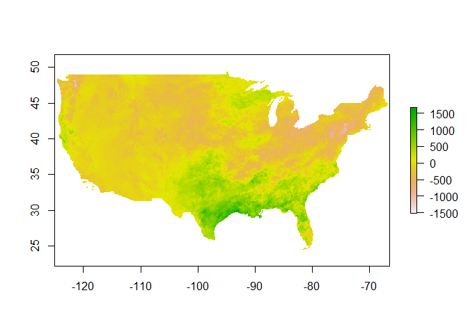

<!-- README.md is generated from README.Rmd. Please edit that file -->

## `prism`

[](https://cran.r-project.org/package=prism)
[](https://travis-ci.org/ropensci/prism)
[](https://ci.appveyor.com/project/sckott/prism/branch/master)
[](https://codecov.io/github/ropensci/prism?branch=master)

This package allows users to access and visualize data from the [Oregon
State PRISM project](http://www.prism.oregonstate.edu/). Data is all in
the form of gridded rasters for the continental US at 3 different
scales: daily, monthly and 30 year normals. Please see their webpage for
a full description of the data products, or [see their
overview](http://www.prism.oregonstate.edu/documents/PRISM_datasets_aug2013.pdf).

### Quickstart

prism is available on CRAN:

``` r
install.packages("prism")
```

Or the development version can be installed from GitHub with devtools:

``` r
# install.packages("devtools")
library(devtools)
install_github(repo = "prism", username = "ropensci")
library(prism)
```

### Downloading data

Data is available in 3 different forms as mentioned above. Each one has
it’s own function to download data. While each data type has slightly
different temporal parameters, the type options are always the same.
Keep in mind these are modeled parameters, not measured. Please see the
[full
description](http://www.prism.oregonstate.edu/documents/Daly2008_PhysiographicMapping_IntJnlClim.pdf)
for how they are calculated.

| Parameter name |              Descrption              |
| :------------: | :----------------------------------: |
|    *tmean*     |           Mean temperature           |
|     *tmax*     |         Maximum temperature          |
|     *tmin*     |         Minimum temperature          |
|    *tdmean*    |      Mean dewpoint temperature       |
|     *ppt*      | Total precipitation (Rain and snow)  |
|    *vpdmin*    | Daily minimum vapor pressure deficit |
|    *vpdmax*    | Daily maximum vapor pressure deficit |

**Normal data**

Normals are based on the years 1981 - 2010, and can be downloaded in two
resolutions, `4km` and `800m`, and a resolution must be specified.
Normals can also be downloaded for a given month, vector of months, or
an average for all 30 years.

``` r
library(prism)
#> Be sure to set the download folder using `prism_set_dl_dir()`.
options(prism.path = "~/prismtmp")
get_prism_normals(type="tmean",resolution = "4km",mon = 1:6, keepZip=F)
#> 
#> PRISM_tmean_30yr_normal_4kmM2_01_bil.zip already exists. Skipping downloading.
#> 
#> PRISM_tmean_30yr_normal_4kmM2_02_bil.zip already exists. Skipping downloading.
#> 
#> PRISM_tmean_30yr_normal_4kmM2_03_bil.zip already exists. Skipping downloading.
#> 
#> PRISM_tmean_30yr_normal_4kmM2_04_bil.zip already exists. Skipping downloading.
#> 
#> PRISM_tmean_30yr_normal_4kmM2_05_bil.zip already exists. Skipping downloading.
#> 
#> PRISM_tmean_30yr_normal_4kmM2_06_bil.zip already exists. Skipping downloading.
```

The first thing to note is that you’ll need to set a local location to
work with this data. Second is the option `keepZip`. If this is `TRUE`
the zip file will remain on your machine, otherwise it will be
automatically deleted.

You can also view all the data you have downloaded with a simple command
`ls_prism_data()`. By default this just gives a list of file names. All
the internal functions in the package work off of this simple list of
files.

``` r
## Truncated to keep file list short
ls_prism_data()[1:10,]
#>  [1] "PRISM_ppt_stable_4kmM2_1965_bil"  
#>  [2] "PRISM_ppt_stable_4kmM2_196501_bil"
#>  [3] "PRISM_ppt_stable_4kmM2_196502_bil"
#>  [4] "PRISM_ppt_stable_4kmM2_196503_bil"
#>  [5] "PRISM_ppt_stable_4kmM2_196504_bil"
#>  [6] "PRISM_ppt_stable_4kmM2_196505_bil"
#>  [7] "PRISM_ppt_stable_4kmM2_196506_bil"
#>  [8] "PRISM_ppt_stable_4kmM2_196507_bil"
#>  [9] "PRISM_ppt_stable_4kmM2_196508_bil"
#> [10] "PRISM_ppt_stable_4kmM2_196509_bil"
```

While internal plotting functions use this, other files may want an
absolute path (e.g. the `raster` package), there’s a parameter `absPath`
that conventiently returns the absolute path. Alternatively you may want
to see what the normal name for the product is (not the file name), and
that parameter is `name`.

``` r
ls_prism_data(absPath = TRUE)[1:10,]
#>                                files
#> 1    PRISM_ppt_stable_4kmM2_1965_bil
#> 2  PRISM_ppt_stable_4kmM2_196501_bil
#> 3  PRISM_ppt_stable_4kmM2_196502_bil
#> 4  PRISM_ppt_stable_4kmM2_196503_bil
#> 5  PRISM_ppt_stable_4kmM2_196504_bil
#> 6  PRISM_ppt_stable_4kmM2_196505_bil
#> 7  PRISM_ppt_stable_4kmM2_196506_bil
#> 8  PRISM_ppt_stable_4kmM2_196507_bil
#> 9  PRISM_ppt_stable_4kmM2_196508_bil
#> 10 PRISM_ppt_stable_4kmM2_196509_bil
#>                                                                              abs_path
#> 1      ~/prismtmp/PRISM_ppt_stable_4kmM2_1965_bil/PRISM_ppt_stable_4kmM2_1965_bil.bil
#> 2  ~/prismtmp/PRISM_ppt_stable_4kmM2_196501_bil/PRISM_ppt_stable_4kmM2_196501_bil.bil
#> 3  ~/prismtmp/PRISM_ppt_stable_4kmM2_196502_bil/PRISM_ppt_stable_4kmM2_196502_bil.bil
#> 4  ~/prismtmp/PRISM_ppt_stable_4kmM2_196503_bil/PRISM_ppt_stable_4kmM2_196503_bil.bil
#> 5  ~/prismtmp/PRISM_ppt_stable_4kmM2_196504_bil/PRISM_ppt_stable_4kmM2_196504_bil.bil
#> 6  ~/prismtmp/PRISM_ppt_stable_4kmM2_196505_bil/PRISM_ppt_stable_4kmM2_196505_bil.bil
#> 7  ~/prismtmp/PRISM_ppt_stable_4kmM2_196506_bil/PRISM_ppt_stable_4kmM2_196506_bil.bil
#> 8  ~/prismtmp/PRISM_ppt_stable_4kmM2_196507_bil/PRISM_ppt_stable_4kmM2_196507_bil.bil
#> 9  ~/prismtmp/PRISM_ppt_stable_4kmM2_196508_bil/PRISM_ppt_stable_4kmM2_196508_bil.bil
#> 10 ~/prismtmp/PRISM_ppt_stable_4kmM2_196509_bil/PRISM_ppt_stable_4kmM2_196509_bil.bil

ls_prism_data(name = TRUE)[1:10,]
#>                                files
#> 1    PRISM_ppt_stable_4kmM2_1965_bil
#> 2  PRISM_ppt_stable_4kmM2_196501_bil
#> 3  PRISM_ppt_stable_4kmM2_196502_bil
#> 4  PRISM_ppt_stable_4kmM2_196503_bil
#> 5  PRISM_ppt_stable_4kmM2_196504_bil
#> 6  PRISM_ppt_stable_4kmM2_196505_bil
#> 7  PRISM_ppt_stable_4kmM2_196506_bil
#> 8  PRISM_ppt_stable_4kmM2_196507_bil
#> 9  PRISM_ppt_stable_4kmM2_196508_bil
#> 10 PRISM_ppt_stable_4kmM2_196509_bil
#>                                  product_name
#> 1       1965 - 4km resolution - Precipitation
#> 2  Jan  1965 - 4km resolution - Precipitation
#> 3  Feb  1965 - 4km resolution - Precipitation
#> 4  Mar  1965 - 4km resolution - Precipitation
#> 5  Apr  1965 - 4km resolution - Precipitation
#> 6  May  1965 - 4km resolution - Precipitation
#> 7  Jun  1965 - 4km resolution - Precipitation
#> 8  Jul  1965 - 4km resolution - Precipitation
#> 9  Aug  1965 - 4km resolution - Precipitation
#> 10 Sep  1965 - 4km resolution - Precipitation
```

You can easily make a quick plot of your data to using the output of
`ls_prism_data()`

``` r
prism_image(ls_prism_data()[1,1])
```

<!-- -->

**Monthly and Daily Data**

Monthly and daily data is also easily accessible. Below we’ll get
January data for the years 1990 to 2000. We an also grab data from June
1 to June 14 2013.

``` r
get_prism_monthlys(type="tmean", year = 1990:2000, mon = 1, keepZip=F)
get_prism_dailys(type="tmean", minDate = "2013-06-01", maxDate = "2013-06-14", keepZip=F)
```

Note that for daily data you need to give a well formed date string in
the form of “YYYY-MM-DD”

You can also visualize a single point across a set of rasters. This
procedure will take a set of rasters, create a stack, extract data at a
point, and then create a ggplot2 object.

Let’s get make a plot of January temperatures is Boulder between 1982
and 2014. First we’ll grab all the data from the US, and then give our
function a point to get data from. The point must be a vector in the
form of longitude, latitude.

``` r
library(ggplot2)
boulder <- c(-105.2797,40.0176)
## Get data.
get_prism_monthlys(type="tmean", year = 1982:2014, mon = 1, keepZip=F)
#> 
#> PRISM_tmean_stable_4kmM3_198201_bil.zip already exists. Skipping downloading.
#> 
#> PRISM_tmean_stable_4kmM3_198301_bil.zip already exists. Skipping downloading.
#> 
#> PRISM_tmean_stable_4kmM3_198401_bil.zip already exists. Skipping downloading.
#> 
#> PRISM_tmean_stable_4kmM3_198501_bil.zip already exists. Skipping downloading.
#> 
#> PRISM_tmean_stable_4kmM3_198601_bil.zip already exists. Skipping downloading.
#> 
#> PRISM_tmean_stable_4kmM3_198701_bil.zip already exists. Skipping downloading.
#> 
#> PRISM_tmean_stable_4kmM3_198801_bil.zip already exists. Skipping downloading.
#> 
#> PRISM_tmean_stable_4kmM3_198901_bil.zip already exists. Skipping downloading.
#> 
#> PRISM_tmean_stable_4kmM3_199001_bil.zip already exists. Skipping downloading.
#> 
#> PRISM_tmean_stable_4kmM3_199101_bil.zip already exists. Skipping downloading.
#> 
#> PRISM_tmean_stable_4kmM3_199201_bil.zip already exists. Skipping downloading.
#> 
#> PRISM_tmean_stable_4kmM3_199301_bil.zip already exists. Skipping downloading.
#> 
#> PRISM_tmean_stable_4kmM3_199401_bil.zip already exists. Skipping downloading.
#> 
#> PRISM_tmean_stable_4kmM3_199501_bil.zip already exists. Skipping downloading.
#> 
#> PRISM_tmean_stable_4kmM3_199601_bil.zip already exists. Skipping downloading.
#> 
#> PRISM_tmean_stable_4kmM3_199701_bil.zip already exists. Skipping downloading.
#> 
#> PRISM_tmean_stable_4kmM3_199801_bil.zip already exists. Skipping downloading.
#> 
#> PRISM_tmean_stable_4kmM3_199901_bil.zip already exists. Skipping downloading.
#> 
#> PRISM_tmean_stable_4kmM3_200001_bil.zip already exists. Skipping downloading.
#> 
#> PRISM_tmean_stable_4kmM3_200101_bil.zip already exists. Skipping downloading.
#> 
#> PRISM_tmean_stable_4kmM3_200201_bil.zip already exists. Skipping downloading.
#> 
#> PRISM_tmean_stable_4kmM3_200301_bil.zip already exists. Skipping downloading.
#> 
#> PRISM_tmean_stable_4kmM3_200401_bil.zip already exists. Skipping downloading.
#> 
#> PRISM_tmean_stable_4kmM3_200501_bil.zip already exists. Skipping downloading.
#> 
#> PRISM_tmean_stable_4kmM3_200601_bil.zip already exists. Skipping downloading.
#> 
#> PRISM_tmean_stable_4kmM3_200701_bil.zip already exists. Skipping downloading.
#> 
#> PRISM_tmean_stable_4kmM3_200801_bil.zip already exists. Skipping downloading.
#> 
#> PRISM_tmean_stable_4kmM3_200901_bil.zip already exists. Skipping downloading.
#> 
#> PRISM_tmean_stable_4kmM3_201001_bil.zip already exists. Skipping downloading.
#> 
#> PRISM_tmean_stable_4kmM3_201101_bil.zip already exists. Skipping downloading.
#> 
#> PRISM_tmean_stable_4kmM3_201201_bil.zip already exists. Skipping downloading.
#> 
#> PRISM_tmean_stable_4kmM3_201301_bil.zip already exists. Skipping downloading.
#> 
#> PRISM_tmean_stable_4kmM3_201401_bil.zip already exists. Skipping downloading.
## We'll use regular expressions to grep through the list and get data only from the month of January
to_slice <- grep("_[0-9]{4}[0][1]",ls_prism_data()[,1],value=T)
to_slice = grep("tmean",to_slice, value = T)
p <- prism_slice(boulder,to_slice)
p + stat_smooth(method="lm",se=F) + theme_bw() + 
ggtitle("Average January temperature in Boulder, CO 1982-2014")
```

<!-- -->

Lastly it’s easy to just load up the prism data with the raster package.
This time what we’ll look at January temperature anomalies. To do this
we’ll examine the difference between January 2013 and the 30 year
normals for January. Conveniently, we’ve already downloaded both of
these files. We just need to grab them out of our list.

``` r
library(raster)
#> Loading required package: sp
### I got these just by looking at the list output
jnorm <- ls_prism_data(absPath=T)[1,2]
j2013 <- ls_prism_data(absPath=T)[52,2]
## See that the full path is returned
jnorm
#> [1] "~/prismtmp/PRISM_ppt_stable_4kmM2_1965_bil/PRISM_ppt_stable_4kmM2_1965_bil.bil"
## Now we'll load the rasters.
jnorm_rast <- raster(jnorm)
j2013_rast <- raster(j2013)
## Now we can do simple subtraction to get the anomaly by subtracting 2014 from the 30 year normal map
anomCalc <- function(x, y) {
  return(x - y)
  }

anom_rast <- overlay(j2013_rast,jnorm_rast,fun = anomCalc)

plot(anom_rast)
```

<!-- -->

The plot shows that January 2013 was warmer than the average over the
last 30 years. It also shows how easy it is to use the raster library to
work with prism data. The package provides a simple framework to work
with a large number of rasters that you can easily download and
vizualize or use with other data sets.

**Javascript maps**

The [leaflet package](https://cran.r-project.org/web/packages/leaflet/)
allows you to easily make javascript maps using the
[leaflet](http://leafletjs.com/) mapping framework using prism data.
These can easily be hosted on websites like [Rpubs](https://rpubs.com/)
or your own site. Here is a simple example of plotting the [30 year
normal for annual temperature](https://rpubs.com/DistribEcology/122453).

``` r
library(leaflet)
library(raster)
library(prism)

## Set default path for raster files
options(prism.path = "~/prismtmp")
get_prism_normals(type="tmean",resolution = "4km",annual =T, keepZip=F)


## Grab the data, ls_prism_data(absPath=T) will show you all the data you've downloaded
norm <- grep("tmean_30yr_normal_4kmM2_annual",ls_prism_data(absPath=T)[,2],value=T)
rast <- raster(norm)


## Create color pallette and plot
pal <- colorNumeric(c("#0000FF", "#FFFF00", "#FF0000"), values(rast),
                    na.color = "transparent")

leaflet() %>% addTiles(urlTemplate = 'http://server.arcgisonline.com/ArcGIS/rest/services/World_Imagery/MapServer/tile/{z}/{y}/{x}') %>% 
  addRasterImage(rast,colors = pal,opacity=.65) %>% addLegend(pal = pal, values = values(rast),
                                                              title = "Deg C")
```
